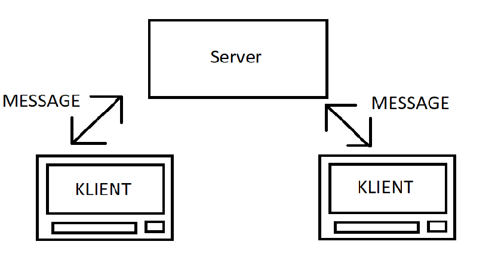

# 23. Lesson

Vaším úkolem pro dnešní hodinu je naprogramovat jednoduchou Chat aplikaci. 
Aplikaci je potřeba už ze začátku rozdělit na dvě části. První částí je server, který příjímá
zprávy o clientů a připosíláje dále na další clienty.

Druhou částí je samotný client, který vizualizuje příchozí data, tak jako v klasické
chatovací aplikaci. 

Toto zadání řešte - ideálně - ve dvojicích tak, aby jeden z vás vytvořil server a druhý klienta.

