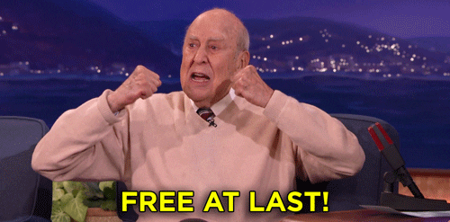

# 9. Hodina
Uvedené body níže vypracujte do projektu Current.
  - Vytvořte třídy Učitel a Student, zaměřte se především na to, aby se váš kód co nejméně duplikovat. (Je potřeba využít ,,extends" neboli nějakého způsobu dědění)
  - Vytvořte metody Fibbonachi a Faktoria. Na vstupu každé metody proveďte validaci vstupů. 
    - V případě, že hodnota je u fibbonachiho menší že 0, tak vyhoďte vlastní RuntimeException. 
    - V případě, že hodnota je u faktoriálu menší než 0, tak vyhoďte vlastní Exception.

## **Domácí úkol**

Žádný domácí úkol a ani úloha nebyla.

